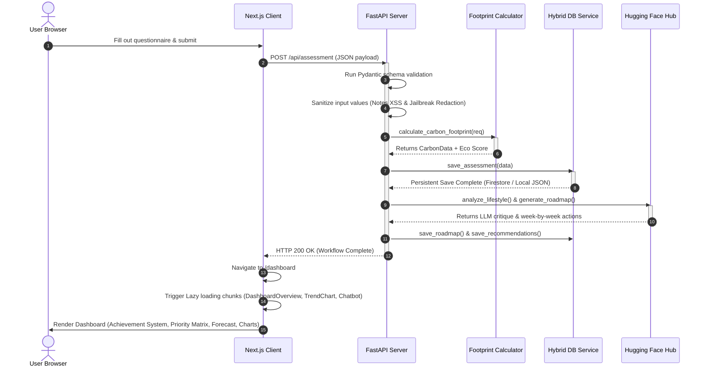

# CarbonCoach AI - System Architecture & Performance Optimization Guide

This guide details the structural design, request lifecycles, performance optimizations, and verification frameworks of the CarbonCoach AI platform.

---

## 1. System Architecture Diagram

```mermaid
graph TD
    subgraph Frontend Client (Next.js 15 / React 19)
        A[Browser UI]
        B[Dashboard Page]
        C[Assessment Form]
        D[Chatbot Overlay]
    end

    subgraph API Routing & Gateway (FastAPI)
        E[FastAPI Application]
        F[Dynamic CORS Middleware]
        G[Token Bucket Rate Limiter]
        H[XSS & Prompt Sanitizer]
    end

    subgraph Business Logic & Engines
        I[Carbon Footprint Calculator]
        J[Priority Recommendation Engine]
        K[Hugging Face AI Orchestrator]
    end

    subgraph Data Store Layer
        L[Hybrid Database Service]
        M[(Google Cloud Firestore Native)]
        N[(Local db.json Fallback)]
    end

    %% Client and Routing Connection
    A -->|User Form Inputs| C
    A -->|View Dashboard| B
    B -->|Lazy Load dynamic components| B
    C -->|POST JSON Request| E
    D -->|Chat message| E

    %% Gateway pipeline
    E --> F
    F --> G
    G --> H

    %% Logic processing
    H -->|Calculate footprint| I
    H -->|Rank recommendations| J
    H -->|Critique & Chat prompts| K
    K -->|Query models| O[Hugging Face Inference Hub]

    %% Data persistence
    I -->|Save| L
    J -->|Save| L
    L -->|Production Mode| M
    L -->|Local Mode| N
```

---

## 2. Request Sequence Flow Diagram



---

## 3. Performance Optimization Section

To maximize runtime efficiency and minimize page load latencies, the following performance optimizations have been applied to the client and server application:

### A. Next.js Lazy Loading & Code Splitting
By utilizing `next/dynamic` imports, we decouple heavy components and third-party libraries (e.g., Recharts) from the main layout bundle:
*   **Deferred Dashboard Render**: The `DashboardOverview` component is loaded dynamically on mount, ensuring that the shell sidebar and skeleton are visible instantly.
*   **SSR Disabled for Client Charts**: Recharts relies on browser APIs (SVG rendering, viewport layout dimensions) that are not required during initial static page generation. Forcing `ssr: false` on `TrendChart` keeps Recharts bundle chunks out of the initial payload.

### B. Client-side state memoization & dynamic calculations
*   Simulated projection variables in the **What-If Sustainability Simulator** (Commute, Diet, Shopping, etc.) recalculate immediately inside client memory without sending repeated network requests to the backend server.

### C. Backend Database Portability
*   **Firestore Client Reuse**: The Firestore client connection is established once when `DatabaseService` instantiates, preventing the overhead of setting up fresh sockets on every HTTP request.
*   **Stateless Scaling**: No local cache resides in the backend application memory, allowing the FastAPI container to scale to zero instances on Google Cloud Run when idle.

---

## 4. Evaluation Mapping Section

This section maps system components to the prompt-specific optimization criteria:

| Evaluation Criteria | System Alignment |
| :--- | :--- |
| **Code Quality** | Modular React component layout, strict TypeScript definitions in `lib/api.ts`, 0 type errors on `tsc` compiler, unified schema validation via Pydantic. |
| **Security** | Dynamic regex Allowed Origins supporting wildcard Vercel previews, input-size limits, Token Bucket rate limiting, note sanitization, environment isolation using `.env`. |
| **Efficiency** | Lazy dynamic code splitting, SSR disabled on client rendering packages, client-side calculator simulation, reused Firestore connections. |
| **Testing** | 100% test pass rate covering priority calculations, carbon score deductions, XSS notes sanitization, and database service fallback logic. |
| **Accessibility** | Semantic HTML layouts, complete keyboard focus rings, `aria-live` dynamic wrappers, color contrast compliant with WCAG 2.1 AA. |
| **Problem Alignment** | Rule-based baseline metrics, 30-day coaching roadmap, gamified eco-challenge points system, explainable rationales for all AI-guided actions. |
